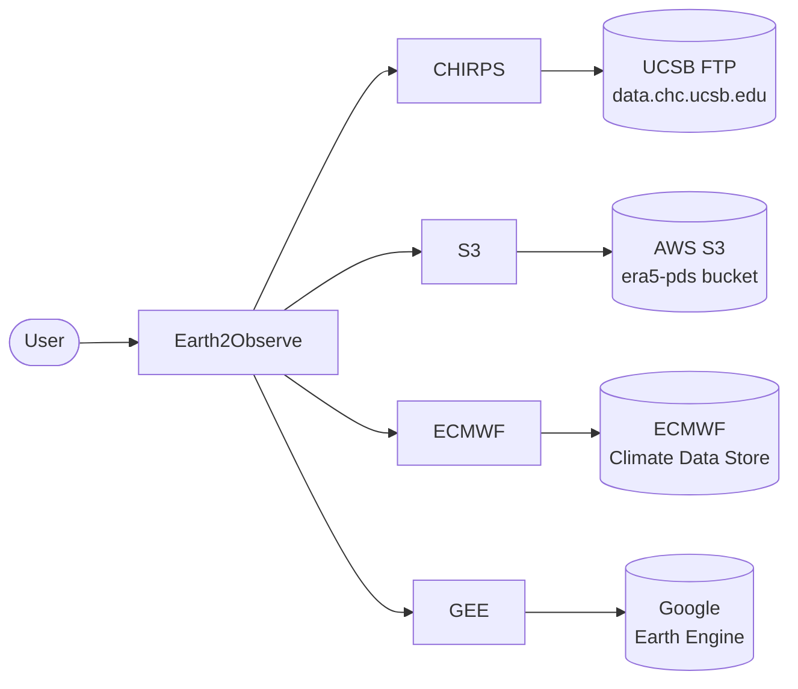
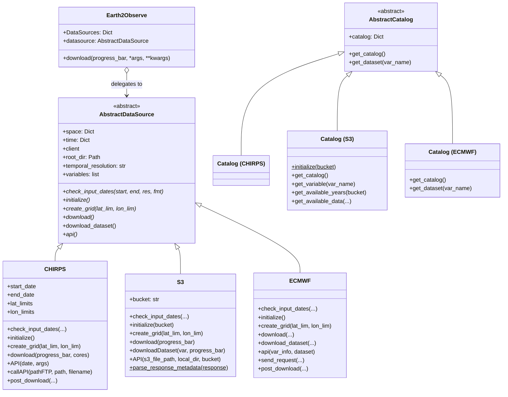
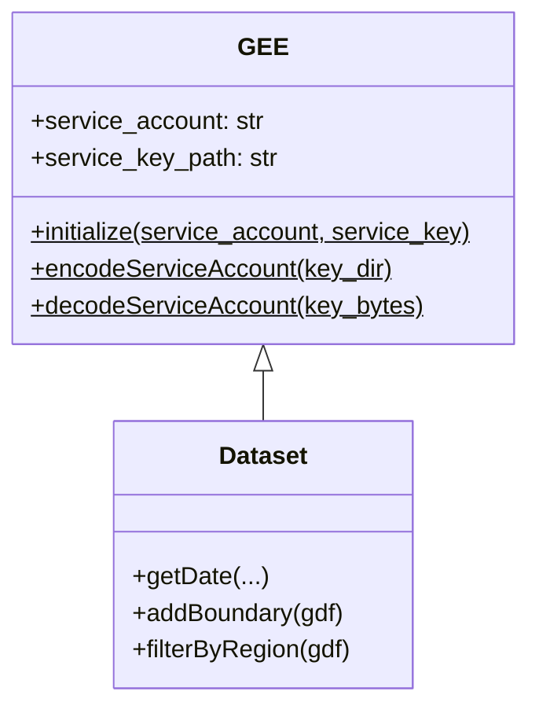
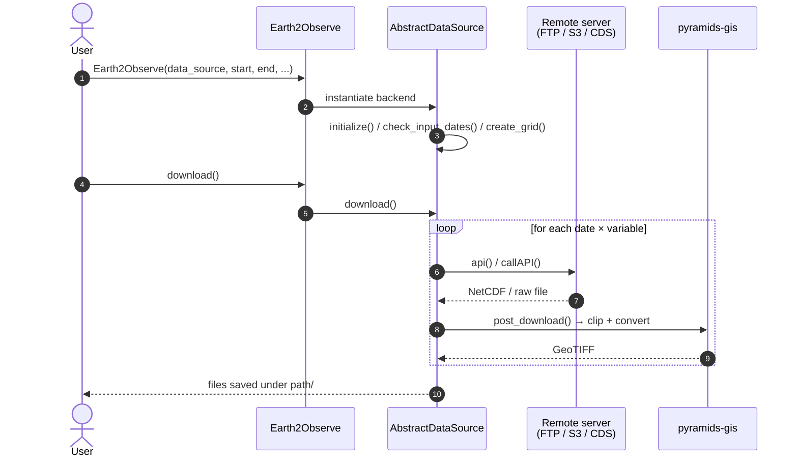
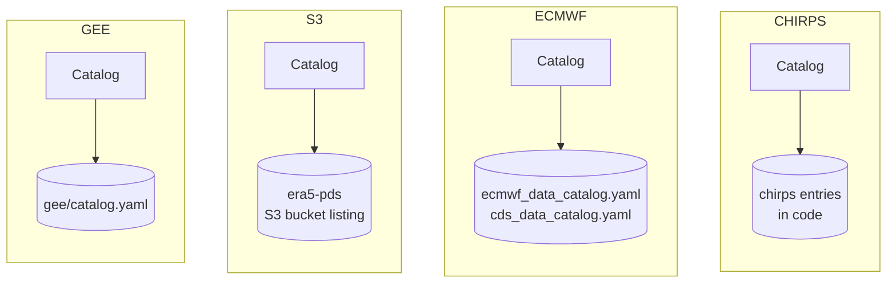

# Architecture

This page documents the internal architecture of `earth2observe` using [Mermaid](https://mermaid.js.org/) diagrams. It replaces the original draw.io class diagram.

## System Overview

The `Earth2Observe` facade exposes a uniform API on top of several concrete data-source backends. Each backend implements the `AbstractDataSource` interface, and each has a companion `Catalog` class that describes available variables.

## Class Diagram

The core abstraction is `AbstractDataSource`. Concrete classes `CHIRPS`, `S3`, `ECMWF`, and the `GEE` subpackage implement it. `AbstractCatalog` plays the same role for the variable/dataset metadata catalogs.

## GEE Subpackage

The Google Earth Engine backend lives in its own subpackage and has a different shape: rather than implementing `AbstractDataSource`, it wraps the `earthengine-api` client directly through a small class hierarchy.

## Download Sequence

The user calls `Earth2Observe.download()`, which delegates to the selected backend. Each backend follows the same high-level sequence: authenticate / open a session, iterate over dates × variables, fetch, and post-process.

## Catalog Pattern

Every data source has a companion `Catalog` class that loads variable metadata from a YAML file (for CHIRPS and ECMWF) or introspects the remote bucket (for S3).

