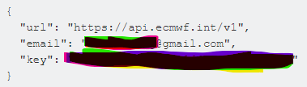

# Data Source Authentication

## ECMWF

1. Register and set up your account on the [ECMWF website](https://apps.ecmwf.int/registration/).

2. Install your ECMWF API key. Instructions are available at:
    - [Access ECMWF Public Datasets](https://confluence.ecmwf.int/display/WEBAPI/Access+ECMWF+Public+Datasets)
    - [Install ECMWF API Key](https://confluence.ecmwf.int/display/WEBAPI/Install+ECMWF+API+Key)
    - [Get your API key](https://api.ecmwf.int/v1/key/)

{ width="400" }

Copy/paste the key into a text file and save it to your `$HOME` directory as `.ecmwfapirc`. On Windows, save it to `C:\Users\<USERNAME>\.ecmwfapirc`.

3. Add environment variables:

```shell
export ECMWF_API_URL="https://api.ecmwf.int/v1"
export ECMWF_API_KEY="************"
export ECMWF_API_EMAIL="<your-email>"
```

## CHIRPS

CHIRPS data source provides data through a public FTP server that does not require any registration.

## Amazon S3

The `era5-pds` bucket provides data publicly and does not require an AWS account to download data.
