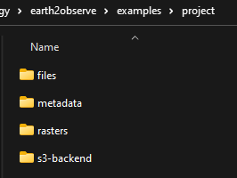
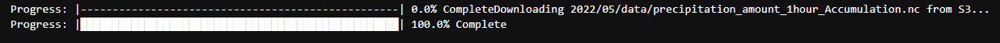

# Data Post Processing

In this tutorial we will:

- Download ERA5 precipitation data from Amazon S3 using earthly
- Convert the downloaded data from NetCDF to GeoTIFF rasters (one per time stamp)
- Create an index map to refer to each cell with an index number
- Create point and polygon geometries as spatial indices
- Convert the rasters into columns in a DataFrame
- Use Uber H3 spatial index for all cells across all 16 resolutions

We will be using:

- `earthly` package
- The convert module in the [pyramids](https://github.com/serapeum-org/pyramids) package (dependency of earthly)

!!! tip
    You can find the whole tutorial as a Jupyter notebook: [post processing of ERA5 data](https://github.com/serapeum-org/earthly/blob/main/examples/post-processing-tutorial.ipynb)

## Packages

Install `earthly`:

=== "conda"

    ```bash
    conda install -c conda-forge earthly
    ```

=== "pip"

    ```bash
    pip install earthly
    ```

Import packages:

```python
import os
import glob
import datetime as dt
from loguru import logger
import geopandas as gpd
import pandas as pd
from pyramids.raster import Raster
from pyramids.convert import Convert
from osgeo import gdal
from osgeo.gdal import Dataset
import numpy as np
from pyramids.indexing import H3
from earthly.earthly import Earthly
```

## Setup

First define the root directory where all the data will be stored:

```python
rdir = "project"
```

The directory should have 4 folders:

```
project/
    files/           # Processed data saved in parquet format
    metadata/        # Index raster, point and polygon geometries
    rasters/         # 1-band raster files converted from NetCDF
    s3-backend/      # Downloaded NetCDF files
```

{ width="300" }

## Earthly Download

Define the earthly parameters and download:

```python
start = "2022-05-01"
end = "2022-05-01"
time = "monthly"
path = f"{rdir}/s3-backend"
source = "amazon-s3"
variables = ["precipitation"]

e2o = Earthly(
    data_source=source,
    temporal_resolution=time,
    start=start,
    end=end,
    path=path,
    variables=variables,
)
e2o.download()
```

{ width="700" }

## Post Processing

Convert the downloaded NetCDF into rasters, one for each time stamp:

```python
nc_file = f"{path}/202205_monthly_precipitation_amount_1hour_Accumulation.nc"
save_to = f"{rdir}/rasters"
Convert.nctoTiff(nc_file, save_to, time_var_name="time1", prefix="Amazon-S3-ERA5")
```

## Spatial Indexing

We create spatial indices for each cell in the downloaded rasters:

1. **Index raster**: An ID for each cell that maps to a row in the DataFrame
2. **Point/polygon geometry**: Center-of-cell points and cell-covering polygons for spatial queries
3. **H3 index**: Hexadecimal spatial index at all 16 resolutions for fast querying

```python
from osgeo.gdal import Dataset

def create_metadata(src: Dataset, path: str):
    """Create the index raster and geometry files (point and polygon).

    Parameters
    ----------
    src : Dataset
        GDAL Dataset.
    path : str
        Path to save the metadata.
    """
    logger.info("First step (creating index raster)")
    arr = src.ReadAsArray()
    rows, cols = arr.shape

    unique_nums = list(range(1, rows * cols + 1))
    arr = np.array(unique_nums)
    new_arr = np.reshape(arr, (rows, cols))
    dst = Raster.rasterLike(src, new_arr, driver="MEM")
    Raster.saveRaster(dst, f"{path}/index.tif")

    logger.info("Second step (Create index point geometry file)")
    gdf = Convert.rasterToGeoDataFrame(dst, add_geometry="point")
    gdf.to_parquet(f"{path}/index_points.parquet", index=False, compression='gzip')

    logger.info("Third step (Create index polygon geometry file)")
    gdf = Convert.rasterToGeoDataFrame(dst, add_geometry="polygon")
    gdf.to_parquet(f"{path}/index_polygon.parquet", index=False, compression='gzip')
    logger.info("Creating index data has finished successfully")
```

Get the raster files and create metadata:

```python
search_criteria = "*.tif"
file_list = glob.glob(os.path.join(f"{rdir}/rasters", search_criteria))

fname = file_list[0]
src = gdal.Open(fname)
meta_data_path = f"{rdir}/metadata"
create_metadata(src, meta_data_path)
```

## Convert to DataFrames

Convert the rasters into a DataFrame using the convert module in the [pyramids](https://github.com/serapeum-org/pyramids) package:

```python
rows = src.RasterYSize
cols = src.RasterXSize
fmt = "%Y.%m.%d.%H.%M.%S"
hourly_fmt = "%Y-%m-%d-%H"
data = np.zeros(shape=(rows * cols, len(file_list))) * np.nan
file_order = []

for i, fname in enumerate(file_list):
    date_fragments = fname.split("_")[-1][:-4]
    file_order.append(dt.datetime.strptime(date_fragments, fmt))
    data[:, i] = Convert.rasterToGeoDataFrame(fname).values.reshape((rows * cols))

col_names = [date_i.strftime(hourly_fmt) for date_i in file_order]
df = pd.DataFrame(data, columns=col_names)
df.to_parquet(f"{rdir}/files/data.parquet", index=False, compression='gzip')
```

## Indexing with H3

Read the parquet file and generate the H3 index for each resolution level:

```python
df = pd.read_parquet(f"{rdir}/files/data.parquet")
point_index = gpd.read_parquet(f"{rdir}/metadata/index_points.parquet")
coords = [(i.x, i.y) for i in point_index["geometry"]]

for res in range(16):
    print(f"H3 resolution: {res}")
    hex = [H3.geometryToIndex(xy[1], xy[0], res) for xy in coords]
    df[f"{res}"] = hex

df.to_parquet(f"{rdir}/files/data.parquet", index=False, compression='gzip')
```

Now all preprocessing is done and the data is saved in parquet format. You can read and query it:

```python
df = pd.read_parquet(f"{rdir}/files/data.parquet")
print(df.head())
```

The columns include datetime values and H3 indices at all 16 resolutions, enabling fast spatial and temporal queries.
