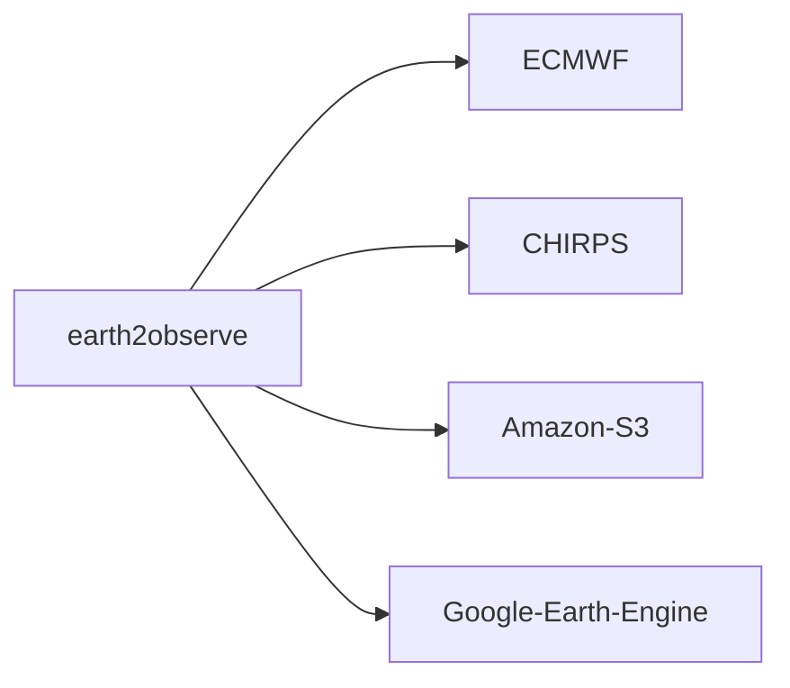

# earth2observe

[](https://serapeum-org.github.io/earth2observe/)
[](https://badge.fury.io/py/earth2observe)
[](https://anaconda.org/conda-forge/earth2observe)

[](https://www.gnu.org/licenses/gpl-3.0)
[](https://github.com/pre-commit/pre-commit)
[](https://codecov.io/gh/serapeum-org/earth2observe)

**earth2observe** is a Python package providing a unified API for several remote sensing data sources.

## Main Features

- **ECMWF**: ERA Interim download from the ECMWF Climate Data Store
- **CHIRPS**: CHIRPS rainfall data download via FTP
- **Amazon S3**: ERA5 data from the public AWS `era5-pds` bucket
- **Google Earth Engine**: GEE data access (under development)



## Quick Start

```python
from earth2observe.earth2observe import Earth2Observe

e2o = Earth2Observe(
    data_source="chirps",
    temporal_resolution="daily",
    start="2009-01-01",
    end="2009-01-10",
    variables=["precipitation"],
    lat_lim=[4.19, 4.64],
    lon_lim=[-75.65, -74.73],
    path="examples/data/chirps",
)
e2o.download()
```

## Installation

=== "conda"

    ```bash
    conda install -c conda-forge earth2observe
    ```

=== "pip"

    ```bash
    pip install earth2observe
    ```

=== "GitHub"

    ```bash
    pip install git+https://github.com/serapeum-org/earth2observe.git
    ```
